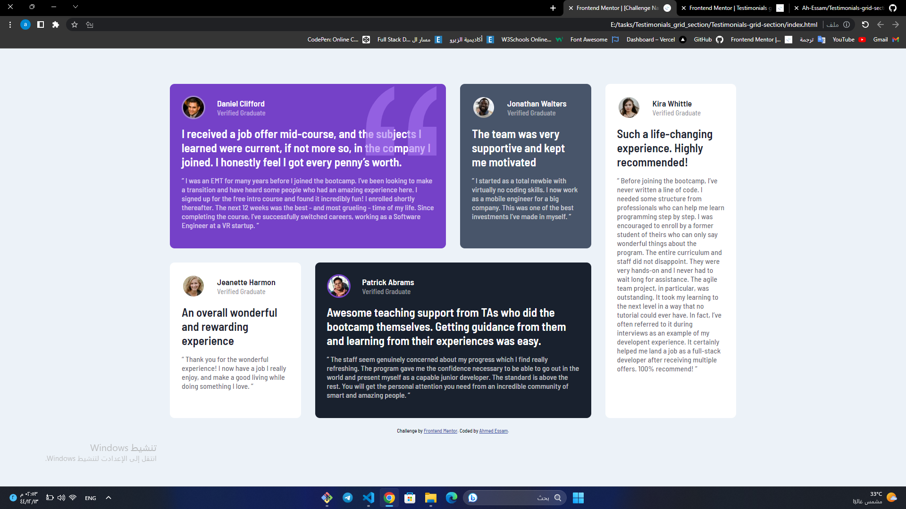
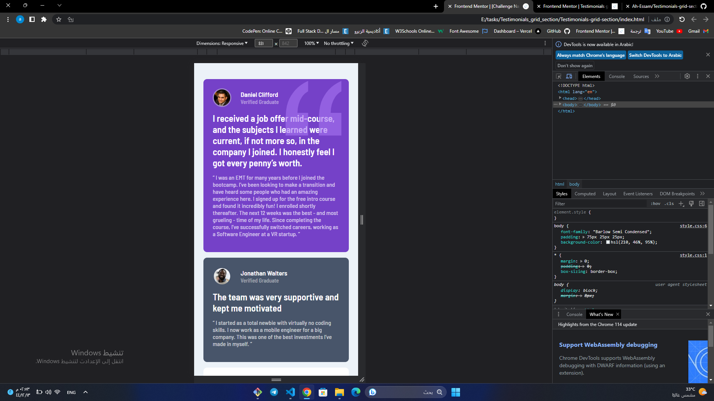
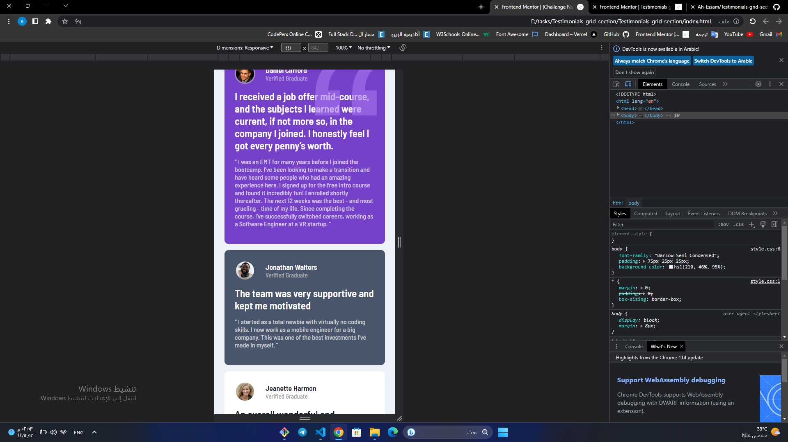

# Frontend Mentor - Testimonials grid section solution

This is a solution to the [Testimonials grid section challenge on Frontend Mentor](https://www.frontendmentor.io/challenges/testimonials-grid-section-Nnw6J7Un7). Frontend Mentor challenges help you improve your coding skills by building realistic projects. 

## Table of contents

- [Overview](#overview)
  - [The challenge](#the-challenge)
  - [Screenshot](#screenshot)
  - [Links](#links)
- [My process](#my-process)
  - [Built with](#built-with)
  - [What I learned](#what-i-learned)
- [Author](#author)

## Overview

### The challenge

Users should be able to:

- View the optimal layout for the site depending on their device's screen size

### Screenshot

### Links

- Solution URL: [solution URL](https://github.com/Ah-Essam/Testimonials-grid-section.git)
- Live Site URL: [live site URL](https://testimonials-grid-section-pf3d-h69vlkin2-ah-essam.vercel.app/)

## My process

### Built with

- HTML5
- CSS3
- Flexbox
- CSS Grid

### What I learned

- using grid

## Author

- Frontend Mentor - [@Ah-Essam](https://www.frontendmentor.io/profile/Ah-Essam)
